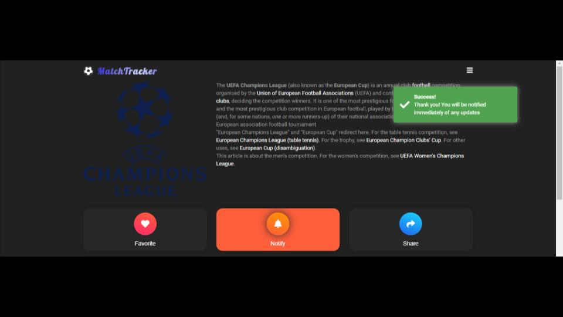

  

<h3 align="center">MatchTracker</h3>

# MatchTracker (Dicoding Submission)

MatchTracker is a dynamic HTML site that makes it easier for you to get the game information including live scores, match results, teams and league tables from the top football leagues and competitions.

  - Competitions
  - Match updates
  - Favorite teams and leagues

## Table of contents

- [Tech](#tech)
- [Installation](#installation)
- [Test the Push Notification](#test-the-push-notification)
- [Copyright and license](#copyright-and-license)

## Tech

This project was generated with [Angular CLI](https://github.com/angular/angular-cli) version 8.1.0 and uses a number of projects to work properly:
* [WebStorm] - awesome web application IDE
* [Materialize] - great UI boilerplate for modern web apps
* [node.js] - evented I/O for the backend
* [football-data API] - The dev-friendly football API
* [jQuery] - duh

## Installation

##### Run the Project
- Install all dependencies:
`npm i`
- Install http-server globally so that it may be run from the command line anywhere:
`npm install --global http-server`
- Run `sh http-server.sh` for serving a PWA app.
- Navigate to `http://localhost:18080/`.

##### Build
Run `ng build` to build the project. The build artifacts will be stored in the `dist/` directory. Use the `--prod` flag for a production build.

Or you can check the [live version] without install.

## Test the Push Notification
- Pick any competition then click on the notification button.

- Wait until the success alert is presented.

- Navigate to http://localhost:18080/notifications (or https://www.matchtracker.site/notifications/) then click on the PUSH button.

- Congrats! You have a new notification.

## Copyright and license
ToDo

   [WebStorm]: <https://jetbrains.com>
   [Materialize]: <https://materializecss.com>
   [live version]: <https://www.matchtracker.site>
   [football-data API]: <https://www.football-data.org/>
   [markdown-it]: <https://github.com/markdown-it/markdown-it>
   [Ace Editor]: <http://ace.ajax.org>
   [node.js]: <http://nodejs.org>
   [Twitter Bootstrap]: <http://twitter.github.com/bootstrap/>
   [jQuery]: <http://jquery.com>
